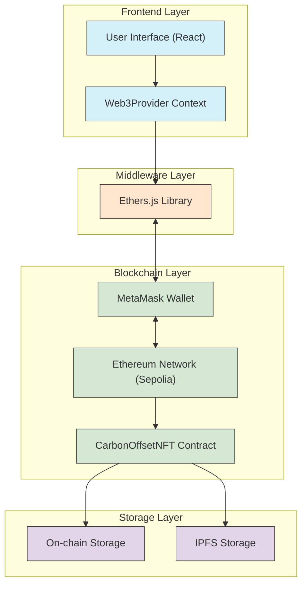
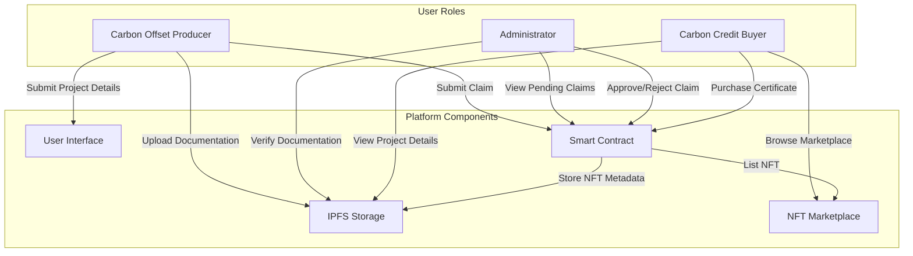
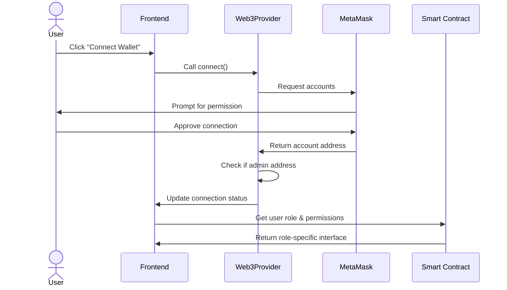
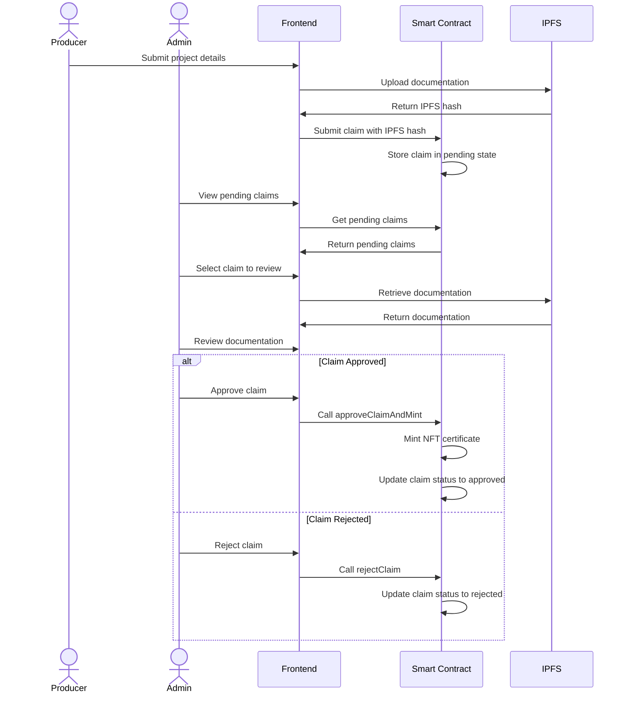
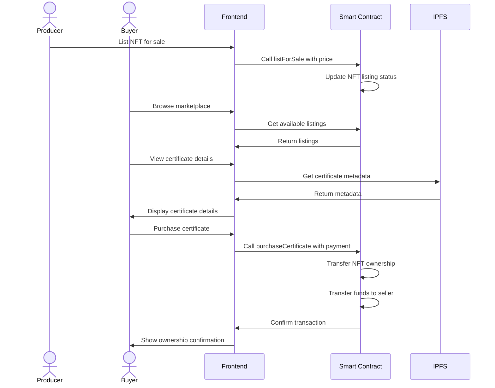
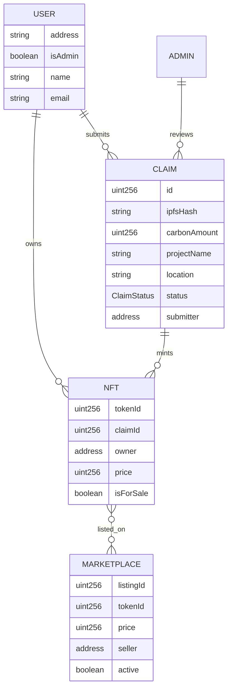
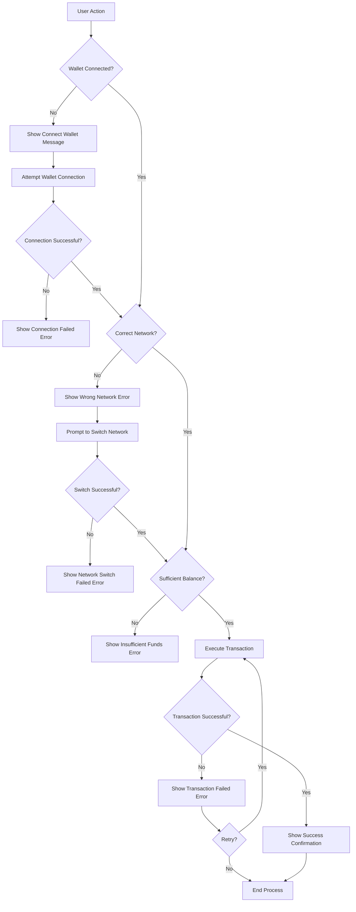

# MiniCarbon: NFT-Based Carbon Offsetting Certificates

## Slide 1: Title

**MiniCarbon: NFT-Based Carbon Offsetting Certificates**

A Blockchain Solution for Transparent Carbon Credit Trading

---

## Slide 2: Agenda

- Problem Statement
- System Overview
- System Architecture
- Implementation Details
- User Workflows
- Comparison with Existing Solutions
- System Analysis
- Future Work
- References

---

## Slide 3: Problem Statement

- Traditional carbon credit systems lack transparency and trust
- High administrative costs and intermediary fees
- Limited accessibility for small-scale participants
- Difficulty in verifying the authenticity of carbon offset claims
- Double-counting and fraud concerns in existing markets

---

## Slide 4: System Overview

**MiniCarbon** is a blockchain-based platform that:

- Tokenizes carbon offset certificates as NFTs
- Provides transparent verification of carbon offset claims
- Creates a peer-to-peer marketplace for carbon credits
- Reduces administrative costs through smart contracts
- Enables fractional ownership of carbon credits

---

## Slide 5: System Architecture Diagram

---

## Slide 6: Architecture Explanation

- **Frontend Layer**: React-based UI with Web3Provider context for wallet integration
- **Middleware Layer**: Ethers.js for blockchain communication
- **Blockchain Layer**: Smart contracts deployed on Sepolia testnet, accessed via MetaMask
- **Storage Layer**: 
  - On-chain storage for transaction data and ownership records
  - IPFS for storing carbon offset documentation and metadata

---

## Slide 7: User Roles

---

## Slide 8: Implementation - Smart Contract

- **ERC-721 Standard**: NFT implementation for unique carbon certificates
- **Key Functions**:
  - `submitClaim()`: Submit carbon offset project details
  - `approveClaimAndMint()`: Verify claim and mint NFT certificate
  - `rejectClaim()`: Reject invalid claims
  - `listForSale()`: List certificate on marketplace
  - `purchaseCertificate()`: Transfer ownership of certificate

---

## Slide 9: Implementation - Authentication Flow

---

## Slide 10: Implementation - Carbon Offset Claim Workflow

---

## Slide 11: Implementation - NFT Marketplace Workflow

---

## Slide 12: Data Model

---

## Slide 13: Error Handling Flow

---

## Slide 14: Comparison with Existing Solutions

| Feature | MiniCarbon | Traditional Carbon Markets | Other Blockchain Solutions |
|---------|------------|----------------------------|----------------------------|
| **Transparency** | Full transparency through blockchain | Limited transparency | Varies by implementation |
| **Verification Process** | Decentralized verification | Centralized authorities | Varies by implementation |
| **Cost** | Low transaction fees | High administrative costs | Medium transaction fees |
| **Accessibility** | Open to all participants | Limited to large entities | Open but technical barriers |
| **Double-counting Prevention** | Guaranteed by blockchain | Manual verification required | Guaranteed by blockchain |
| **Fractional Ownership** | Supported | Limited or not available | Varies by implementation |
| **Market Liquidity** | High through NFT marketplace | Low to medium | Medium |
| **Data Privacy** | Configurable privacy options | Limited data access | Varies by implementation |

---

## Slide 15: Comparison with Research Implementations

| Feature | MiniCarbon | Shielded NFTs (Springer) | Carbon Collectible NFTs |
|---------|------------|--------------------------|-------------------------|
| **Blockchain Platform** | Ethereum (Sepolia) | Custom/Ethereum | Multiple platforms |
| **Privacy Mechanism** | Basic | Zero-knowledge proofs | Basic |
| **Fractional Ownership** | Full support | Full support | Limited support |
| **Verification Method** | Admin verification | Automated with IoT | Manual verification |
| **Energy Efficiency** | Medium (Ethereum-based) | Varies by implementation | Varies by platform |
| **Integration with IoT** | Planned for future | Fully integrated | Limited |
| **Regulatory Compliance** | Basic implementation | GDPR-compliant | Varies |

---

## Slide 16: System Analysis - Strengths

- **Transparency**: Full visibility of carbon offset claims and verification process
- **Immutability**: Once verified, carbon offset data cannot be altered
- **Accessibility**: Lower barriers to entry for small-scale carbon offset producers
- **Cost Efficiency**: Reduced administrative costs through smart contracts
- **Market Efficiency**: Direct peer-to-peer trading without intermediaries
- **Fraud Prevention**: Blockchain prevents double-counting and fraudulent claims

---

## Slide 17: System Analysis - Limitations

- **Scalability Challenges**: Ethereum transaction throughput limitations
- **Energy Consumption**: Blockchain operations have their own carbon footprint
- **Regulatory Uncertainty**: Evolving regulations for blockchain carbon markets
- **Technical Barriers**: Users need basic understanding of blockchain technology
- **Initial Verification**: Still requires trusted verification of initial carbon offset claims
- **Market Adoption**: Requires critical mass of users for marketplace liquidity

---

## Slide 18: Future Work

- Integration with IoT devices for automated carbon measurement
- Implementation of zero-knowledge proofs for enhanced privacy
- Cross-chain compatibility for increased market reach
- Mobile application development for improved accessibility
- Integration with existing carbon credit registries
- Enhanced analytics dashboard for carbon impact visualization
- Implementation of governance mechanisms for community-driven verification

---

## Slide 19: Key Takeaways

- MiniCarbon leverages blockchain technology to create a transparent, efficient carbon offset marketplace
- NFT-based certificates provide unique, verifiable proof of carbon offset ownership
- Smart contracts automate verification and trading processes, reducing costs
- The system addresses key limitations of traditional carbon markets
- Future enhancements will focus on scalability, privacy, and integration with external systems

---

## Slide 20: References

1. Strüker, J., Weibelzahl, M., Körner, MF. et al. (2022). Enabling end-to-end digital carbon emission tracing with shielded NFTs. Energy Informatics, 5(1). https://doi.org/10.1186/s42162-022-00199-3

2. Researchers. (2021). A Blockchain-based Carbon Credit Ecosystem. ResearchGate. https://www.researchgate.net/publication/353056794_A_Blockchain-based_Carbon_Credit_Ecosystem

3. Patel et al. (2020). Carbon Credits on Blockchain. ResearchGate. https://www.researchgate.net/publication/340813301_Carbon_Credits_on_Blockchain

4. Academy of Strategic Management Journal. (2022). Strategic Management of Carbon Footprint Using Carbon Collectible Non-fungible Tokens (NFTs) on Blockchain. https://www.abacademies.org/articles/strategic-management-of-carbon-footprint-using-carbon-collectible-nonfungible-tokens-nfts-on-blockchain-14379.html

5. NFTree. (2021). NFTree – Help to capture CO2 with non-fungible tokens. https://nftree.org/